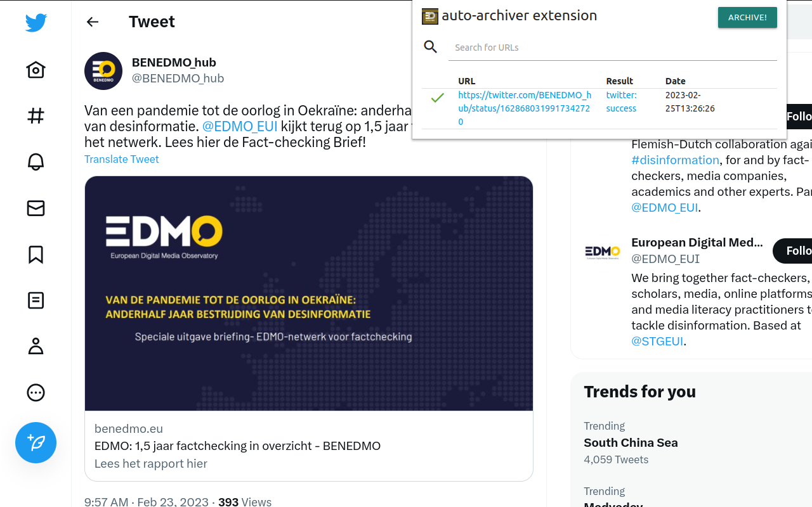

# Auto Archiver Extension

Chromium browser extension that connects to an API that calls [Belligncat's auto-archiver](https://github.com/bellingcat/auto-archiver). 

> Beta deployment: only authorized emails can use it. Available on [chrome web store](https://chrome.google.com/webstore/detail/auto-archiver-extension/ojcimmjndnlmmlgnjaeojoebaceokpdp)

### 🛠 Build locally

1. Checkout the copied repository to your local machine eg. with `git clone https://github.com/bellingcat/auto-archiver-extension`
1. Run `npm install` to install all required dependencies
1. Run `npm run build`

The build step will create the `distribution` folder, this folder will contain the generated extension. There's also a `distribution.zip` file.

### 🏃 Run the extension

Using [web-ext](https://extensionworkshop.com/documentation/develop/getting-started-with-web-ext/) is recommended for automatic reloading and running in a dedicated browser instance. Alternatively you can load the extension manually (see below). The UI is build with vue.js.

1. Run `npm run watch` to watch for file changes and build continuously
1. Run `npm install --global web-ext` (only only for the first time)
1. In another terminal, run `web-ext run -t chromium`
1. Check that the extension is loaded by opening the extension options ([in Firefox](media/extension_options_firefox.png) or [in Chrome](media/extension_options_chrome.png)).

<!-- > You need to connect to a backend of the [bellingcat/auto-archiver-api](https://github.com/bellingcat/auto-archiver-api) make sure to setup that too. -->

#### Manually

You can also [load the extension manually in Chrome](https://www.smashingmagazine.com/2017/04/browser-extension-edge-chrome-firefox-opera-brave-vivaldi/#google-chrome-opera-vivaldi) or [Firefox](https://www.smashingmagazine.com/2017/04/browser-extension-edge-chrome-firefox-opera-brave-vivaldi/#mozilla-firefox).

### Publishing (TODO)

It's possible to automatically publish to both the Chrome Web Store and Mozilla Addons at once by adding these secrets on GitHub Actions:

1. `CLIENT_ID`, `CLIENT_SECRET`, and `REFRESH_TOKEN` from [Google APIs][link-cws-keys].
2. `WEB_EXT_API_KEY`, and `WEB_EXT_API_SECRET` from [AMO][link-amo-keys].

Also include `EXTENSION_ID` in the secrets ([how to find it](https://stackoverflow.com/a/8946415/288906)) and add Mozilla’s [`gecko.id`](https://developer.mozilla.org/en-US/docs/Mozilla/Add-ons/WebExtensions/manifest.json/browser_specific_settings) to `manifest.json`.

The GitHub Actions workflow will:

1. Build the extension
2. Create a version number based on the current UTC date time, like [`19.6.16`](https://github.com/fregante/daily-version-action) and sets it in the manifest.json
3. Deploy it to both stores

#### Auto-publishing

Thanks to the included [GitHub Action Workflows](.github/workflows), if you set up those secrets in the repo's Settings, the deployment will automatically happen:

- on a schedule, by default [every week](.github/workflows/release.yml) (but only if there are any new commits in the last tag)
- manually, by clicking ["Run workflow"](https://github.blog/changelog/2020-07-06-github-actions-manual-triggers-with-workflow_dispatch/) in the Actions tab.

#### Funding

 

This project is funded by the European Union under contract number: INEA/CEF/ICT/A2020/2381738.

Dit project is gefinancierd door de Europese Unie onder overeenkomstnummer: INEA/CEF/ICT/A2020/2381738. 